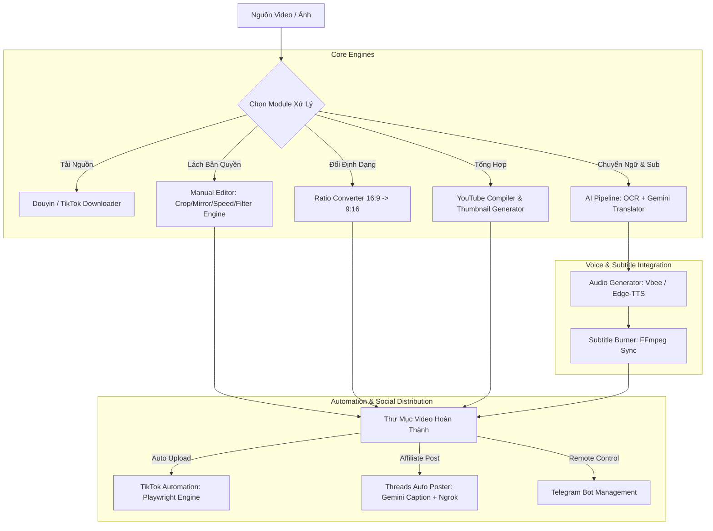

<div align="center">

# ✦ Video AI Pro Studio (Tool All) ✦

### *Hệ Thống Tự Động Hóa Xử Lý Video, Lách Bản Quyền AI & Đăng Tải Đa Nền Tảng*

[](https://www.python.org/)
[](https://github.com/TomSchimansky/CustomTkinter)
[](https://github.com/hndzgit/Tool-All-hndz/actions)
[](https://github.com/hndzgit/Tool-All-hndz)
[](https://github.com/hndzgit/Tool-All-hndz)

</div>

---

## 📌 Mục Lục (Table of Contents)
- [✨ Tổng Quan Dự Án](#-tổng-quan-dự-án)
- [🧩 Sơ Đồ Kiến Trúc Hệ Thống (Architecture)](#-sơ-đồ-kiến-trúc-hệ-thống-architecture)
- [🚀 Danh Sách Tính Năng & Module Chức Năng](#-danh-sách-tính-năng--module-chức-năng)
  - [1. Phân Hệ Xử Lý & Edit Video](#1-phân-hệ-xử-lý--edit-video)
  - [2. Phân Hệ Đăng Tải & Mạng Xã Hội](#2-phân-hệ-đăng-tải--mạng-xã-hội)
  - [3. Phân Hệ Công Cụ Phụ Trợ](#3-phân-hệ-công-cụ-phụ-trợ)
- [🗂️ Cấu Trúc Mã Nguồn (Directory Structure)](#%EF%B8%8F-cấu-trúc-mã-nguồn-directory-structure)
- [💻 Hướng Dẫn Cài Đặt & Chạy Ứng Dụng](#-hướng-dẫn-cài-đặt--chạy-ứng-dụng)
- [⚙️ Cấu Hình API Key & Thiết Lập](#%EF%B8%8F-cấu-hình-api-key--thiết-lập)
- [🛠️ Giải Quyết Lỗi Thường Gặp (Troubleshooting)](#%EF%B8%8F-giải-quyết-lỗi-thường-gặp-troubleshooting)
- [⚖️ Bản Quyền & Sở Hữu Trí Tuệ](#%EF%B8%8F-bản-quyền--sở-hữu-trí-tuệ)

---

## ✨ Tổng Quan Dự Án

**Video AI Pro Studio** (tên gọi khác: **Tool All**) là giải pháp phần mềm desktop cao cấp được thiết kế nhằm tự động hóa 100% quy trình sản xuất, lách bản quyền và phân phối video ngắn/dài cho Content Creators, Affiliate Marketers và NPH Video chuyên nghiệp.

Ứng dụng tích hợp các công nghệ hàng đầu hiện nay:
- **Google Gemini 1.5/2.0 API & Gemini Vision**: Phân tích ảnh đơn hàng, dịch thuật thông minh, viết caption chuẩn SEO.
- **Vbee TTS & Edge-TTS**: Tạo giọng đọc AI truyền cảm, tự nhiên, đa ngữ điệu.
- **OpenCV & FFmpeg Filter Engine**: Xử lý hiệu ứng đồ họa, chống quét thuật toán bản quyền YouTube/TikTok.
- **Playwright Browser Automation**: Tự động hóa đăng tải bài viết/video chống phát hiện bot.

---

## 🧩 Sơ Đồ Kiến Trúc Hệ Thống (Architecture)



---

## 🚀 Danh Sách Tính Năng & Module Chức Năng

### 1. Phân Hệ Xử Lý & Edit Video

| Icon | Tên Module | Chức Năng Chính |
| :---: | :--- | :--- |
| ▶ | **AI Pipeline (Chính)** | Tự động nhận diện chữ (OCR), dịch thuật tiếng Trung/Anh ➔ Việt, tạo giọng đọc AI (Vbee/Edge-TTS) và chèn phụ đề tự động. |
| 🤖 | **Video AI Cặp** | Nhận diện ảnh sản phẩm/đơn hàng với Gemini Vision, ghép video giới thiệu sản phẩm bán hàng tự động. |
| 🎬 | **Edit & Lách Bản Quyền YT** | Áp dụng thuật toán lách bản quyền video dài: lật hình, thay đổi tốc độ (speed), pitch âm thanh, cân bằng EQ, làm mờ khung hình. |
| 🎬 | **Edit & Lách TikTok (Dọc)** | Tối ưu riêng cho video dọc 9:16 trên TikTok, Reels, Shorts với bộ lọc chống quét AI TikTok. |
| ✂️ | **Cắt Video 59s** | Tự động cắt các đoạn highlight dưới 59 giây để đăng video ngắn ngắn ngắn tối ưu tương tác. |
| ✂️ | **Cắt Video Hàng Loạt** | Cắt ngắt đoạn video hàng loạt theo khung thời gian định sẵn. |
| 📱 | **Đổi Ngang ➔ Dọc** | Chuyển đổi chuẩn xác từ 16:9 ngang sang 9:16 dọc với kỹ thuật làm mờ phông nền (Blur background) tinh tế. |
| 🎥 | **Ghép & Edit Video YT** | Biên tập ghép nối nhiều clip ngắn thành 1 video tổng hợp YouTube dài, tích hợp bộ công cụ tự tạo Thumbnail giật gân. |
| 🎵 | **Gắn Nhạc Hàng Loạt** | Chèn nhạc nền (BGM) cho hàng trăm video cùng lúc, tự động điều chỉnh âm lượng voice và music. |
| 💧 | **Auto Watermark** | Chèn logo, nhận diện thương hiệu hoặc chữ bảo hộ vào vị trí bất kỳ trên video hàng loạt. |

### 2. Phân Hệ Đăng Tải & Mạng Xã Hội

- **🎵 TikTok Auto-Up**: Đăng video tự động lên TikTok sử dụng Playwright qua trình duyệt Chromium thật, duy trì phiên đăng nhập không cần đăng nhập lại.
- **🧵 Threads Affiliate**: Tự động lấy link sản phẩm, dùng Gemini AI viết status hấp dẫn và đăng kèm video/hình ảnh lên Threads.
- **📥 Tải Nguồn MXH**: Tải video gốc HD không dính logo (Watermark-free) từ Douyin, TikTok, Kuaishou,...

### 3. Phân Hệ Công Cụ Phụ Trợ

- **💬 Telegram Bot**: Cho phép gửi lệnh điều khiển từ xa, nhận thông báo tiến độ render video trực tiếp qua Telegram.
- **🗣️ Text to Speech (TTS Tool)**: Chuyển đổi văn bản tùy chỉnh thành file âm thanh mp3 với hàng chục giọng đọc Vbee, Edge-TTS chất lượng cao.

---

## 🗂️ Cấu Trúc Mã Nguồn (Directory Structure)

```text
Tool-All-hndz/
├── .github/
│   └── workflows/
│       └── ci.yml              # Quy trình kiểm thử tự động GitHub Actions
├── run.sh                      # Script khởi chạy nhanh cho macOS/Linux
├── build_mac_app.sh            # Script đóng gói ứng dụng standalone macOS (.app)
├── LICENSE                     # File bản quyền thuộc về Trần Hoài Nam
├── README.md                   # Tài liệu hướng dẫn sử dụng dự án
└── modules/
    ├── main_gui.py             # Giao diện điều khiển trung tâm (Main GUI)
    ├── automation/             # Core Engine: OCR, Translation, Subtitle, TTS
    ├── ai_video/               # Core Engine: Gemini Vision AI Video Maker
    ├── manual_editor/          # Core Engine: Anti-Copyright Editing Engine
    ├── trimmer/                # Module Cắt Video Shorts 59s
    ├── ratio_converter/        # Module Đổi Tỷ Lệ Video (16:9 -> 9:16)
    ├── yt_compiler/            # Module Biên Tập & Ghép Video YouTube
    ├── bgm_injector/           # Module Gắn Nhạc Nền Hàng Loạt
    ├── watermark/              # Module Thêm Watermark / Logo
    ├── tiktok_upload/          # Module Đăng Video TikTok (Playwright)
    ├── threads/                # Module Đăng Bài Threads Affiliate
    ├── douyin/                 # Module Downloader Video Douyin/TikTok
    ├── bot/                    # Telegram Bot Controller
    ├── tts_tool/               # Công Cụ Text-To-Speech Độc Lập
    └── requirements.txt        # Danh sách thư viện Python cần thiết
```

---

## 💻 Hướng Dẫn Cài Đặt & Chạy Ứng Dụng

### 1. Yêu Cầu Tiền Đề
- **Python**: Phiên bản `3.10` trở lên.
- **FFmpeg**: Công cụ xử lý media cần có trong PATH hệ thống.
  - Trên **macOS**: `brew install ffmpeg`
  - Trên **Windows**: Tải FFmpeg và thêm vào `Path` của Environment Variables.

### 2. Các Bước Cài Đặt

```bash
# 1. Clone repository về máy cá nhân
git clone https://github.com/hndzgit/Tool-All-hndz.git
cd Tool-All-hndz

# 2. Khởi tạo môi trường ảo Python
python3 -m venv .venv

# 3. Kích hoạt môi trường ảo
# Trên macOS / Linux:
source .venv/bin/activate
# Trên Windows (PowerShell):
# .venv\Scripts\Activate.ps1

# 4. Cài đặt các thư viện Python
pip install --upgrade pip
pip install -r modules/requirements.txt

# 5. Cài đặt trình duyệt cho Playwright (TikTok / Threads Automation)
playwright install chromium
```

### 3. Khởi Chạy Phần Mềm

```bash
# Cách 1: Chạy trực tiếp script chính
python modules/main_gui.py

# Cách 2: Chạy qua script tự động (macOS/Linux)
chmod +x run.sh
./run.sh
```

---

## ⚙️ Cấu Hình API Key & Thiết Lập

Một số tính năng nâng cao yêu cầu API Key (Gemini API, Vbee API). Bạn có thể cấu hình trực tiếp trên giao diện GUI hoặc cập nhật trong file `modules/automation/config/settings.json`:

```json
{
    "gemini_api_key": "YOUR_GEMINI_API_KEY_HERE",
    "vbee_api_key": "YOUR_VBEE_API_KEY_HERE",
    "target_language": "Tiếng Việt",
    "font_name": "BeVietnamPro-Bold.ttf"
}
```

---

## 🛠️ Giải Quyết Lỗi Thường Gặp (Troubleshooting)

<details>
<summary><b>1. Lỗi FFmpeg not found khi render video</b></summary>

> **Nguyên nhân**: Máy tính chưa cài đặt FFmpeg hoặc FFmpeg chưa được thêm vào biến môi trường PATH.  
> **Khắc phục**: Chạy `brew install ffmpeg` trên macOS hoặc kiểm tra lệnh `ffmpeg -version` trên Terminal/CMD.
</details>

<details>
<summary><b>2. Lỗi Playwright Chromium không khởi động</b></summary>

> **Nguyên nhân**: Trình duyệt Chromium của Playwright chưa được tải về.  
> **Khắc phục**: Chạy lệnh `playwright install chromium` trong môi trường ảo của dự án.
</details>

---

## ⚖️ Bản Quyền & Sở Hữu Trí Tuệ

**© 2026 Trần Hoài Nam. All rights reserved.**

- Toàn bộ bản quyền mã nguồn, giao diện và tài sản trí tuệ của dự án này thuộc về **Trần Hoài Nam**.
- Mọi hình thức sao chép, phân phối lại hoặc sử dụng vào mục đích thương mại khi chưa có sự đồng ý bằng văn bản của tác giả đều bị nghiêm cấm.

---

<div align="center">

**Developed with ❤️ & Expertise by Trần Hoài Nam**

[🌐 GitHub Repository](https://github.com/hndzgit/Tool-All-hndz) • [📧 Báo Lỗi & Đề Xuất](https://github.com/hndzgit/Tool-All-hndz/issues)

</div>
